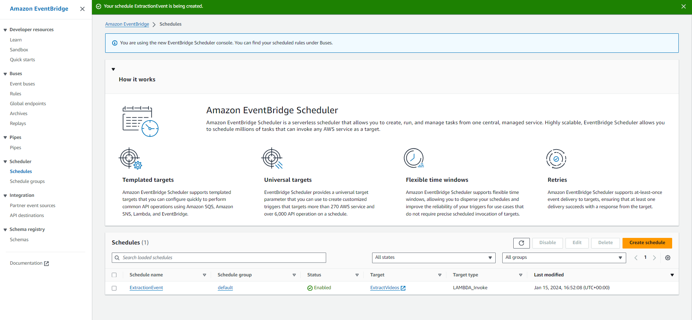

# Youtube-ETL-on-AWS

### Architecture

## AWS Services i used:
##### AWS Elastic Container Registry: To store lambda function py file and its dependencies
##### AWS Glue: Used in ETL for json data processing
##### AWS Lambda: To write data extraction function and converting it to parquet.
##### AWS QuickSight: For Data Visaulization
##### Amazon EventBridge:  You can use this service to schedule the lambda extraction function to run at every midnight to extract daily trending videos.
##### AWS Athena: To query data from AWS Data Catalog

##### First write data extraction function in lambda to extraction trending videos from Youtube API and write this data in S3 buckets.(same for categories data)
##### Note: I have used AWS ECR here for my lambda function to package the py file and dependencies as container because lambda do not allow layers of more than 50mb and I had to use different libraries.

##### You can schedule this lambda function in AWS EventBridge service

##### After running the Extraction flow. Json files will be written to S3 buckets.

##### Then I will be using another lambda function to flatten the extracted data and write it as a parquet file.

##### From the above function. Schema of our data will be writen to Glue Data Cataglog and a table

##### Having two datasets Categories and Videos in Data Cataglog. We can do ETL on it using AWS Glue ETL. I am joining both the datasets and selecting only the required fields.

##### This job will write the output file in analytics s3 bucket and schema in Data Catalog which we can query in Athena

#### Finally, we will be using this finalized dataset in AWS QuickSight to create visualization.

##### I have not used all the data here for the visulizations

#### Fin.
